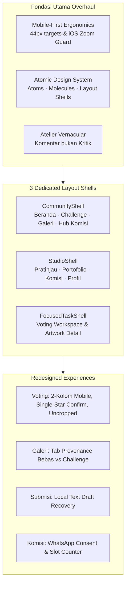

# Mengart Atelier — Frontend UI/UX Overhaul & Atomic Design System

[](https://github.com/GarionAdiwilaga/mengart/tree/overhaul_frontend_atomic_design)
[](https://nextjs.org/)
[](https://react.dev/)
[](https://www.typescriptlang.org/)
[](https://tailwindcss.com/)
[](https://playwright.dev/)
[](https://github.com/GarionAdiwilaga/mengart)

This branch (`overhaul_frontend_atomic_design`) delivers a comprehensive, mobile-first frontend architecture and user experience redesign for **Mengart Atelier**, built strictly in accordance with **`studio-atelier-frontend-style-guide.md`** and **`Mengart frontend overhaul blueprint v0.3`**.

It eliminates disconnected page experiences, solves broken terminology with natural Indonesian (*"Atelier Vernacular"*), introduces an **Atomic Design System** with three dedicated layout shells, hardens backend contracts, and provides a seamless mobile touch experience ($\ge 44$px targets, iOS Safari auto-zoom prevention).

---

## 🏛️ Table of Contents

- [Branch Highlights & Core Upgrades](#-branch-highlights--core-upgrades)
- [Atomic Design System Hierarchy](#-atomic-design-system-hierarchy)
- [Key User Journeys & Screen Redesigns](#-key-user-journeys--screen-redesigns)
  - [1. Persistent 4-Destination Navigation](#1-persistent-4-destination-navigation)
  - [2. Alur Challenge & Voting Workspace](#2-alur-challenge--voting-workspace)
  - [3. Connected Gallery & Provenance Separation](#3-connected-gallery--provenance-separation)
  - [4. Immersive Artwork Detail Screen](#4-immersive-artwork-detail-screen)
  - [5. Creator Studio Landing & Management](#5-creator-studio-landing--management)
  - [6. Commission Collective Hub & WhatsApp Consent](#6-commission-collective-hub--whatsapp-consent)
- [Backend Contract & Security Repairs (A01–A08)](#-backend-contract--security-repairs-a01a08)
- [Atelier Vernacular (Terminology Refinements)](#-atelier-vernacular-terminology-refinements)
- [Independent QA Verification Matrix](#-independent-qa-verification-matrix)
- [Inherited Foundation & Domain Invariants](#-inherited-foundation--domain-invariants)
- [Getting Started & Local Execution](#-getting-started--local-execution)

---

## 🌟 Branch Highlights & Core Upgrades



* **Mobile-First & Touch Ergonomics:** Built touch-first. All interactive buttons, tabs, and actions strictly satisfy $\ge 44$px touch dimensions. All text inputs enforce `text-base sm:text-xs` / `text-base sm:text-sm` to eliminate iOS Safari viewport auto-zoom.
* **Atomic Component Architecture:** Extracted clean, reusable components into `src/components/ui/atoms/`, `src/components/ui/molecules/`, and `src/components/layout/shells/`.
* **Submission Text Recovery:** Unsubmitted contest text (title & description) auto-saves locally per challenge (`mengart_sub_draft:${challengeId}`). Reloading restores the draft with an informative recovery banner and 1-click "Buang draf" action.
* **Gallery Provenance Separation:** Independent creator uploads and challenge entries are distinctly browsable via `[ Karya Bebas | Karya Challenge ]` segmented tabs synced with URL query parameters (`?tab=bebas`, `?tab=challenge`).
* **Inclusive Atelier Vernacular:** Completely replaced competitive/intimidating "Kritik" labels with welcoming, creator-respectful **"Komentar"** and **"Komentar Terbuka"**.
* **Prerequisite Contract Repairs (A01–A08):** Closed 8 critical security, privacy, and schema-parity vulnerabilities before launching the new visual layer.

---

## 🧱 Atomic Design System Hierarchy

All UI components reside in a strictly typed, accessible component hierarchy:

### Atoms (`src/components/ui/atoms/`)
| Atom | Purpose | Key Features |
|---|---|---|
| [`AtelierButton`](src/components/ui/atoms/AtelierButton.tsx) | Primary interactive button | Varian: `primary-amber`, `surface`, `ghost`, `danger`, `outline-amber`. $\ge 44$px touch targets, loading spinner state. |
| [`AtelierBadge`](src/components/ui/atoms/AtelierBadge.tsx) | Status & category badge | Varian: `amber`, `success`, `danger`, `muted`, `default`. Sentence-case typography. |
| [`SegmentedPill`](src/components/ui/atoms/SegmentedPill.tsx) | Multi-option segmented control | Keyboard navigation, active indicator transitions, touch-friendly pill targets. |
| [`AtelierInput`](src/components/ui/atoms/AtelierInput.tsx) | Text form input | Enforces `text-base sm:text-sm` to prevent iOS Safari auto-zoom, focus rings. |
| [`AtelierTextarea`](src/components/ui/atoms/AtelierTextarea.tsx) | Multi-line text field | Auto-expanding textarea with zoom-prevention styles and character counts. |
| [`TimestampWITA`](src/components/ui/atoms/TimestampWITA.tsx) | Operational datetime display | Tabular numerals in *JetBrains Mono*, standardized UTC+8 (WITA) rendering. |
| [`StatusDot`](src/components/ui/atoms/StatusDot.tsx) | Live status indicator | Subtle pulsing dot indicating open submissions, voting, or online availability. |

### Molecules (`src/components/ui/molecules/`)
| Molecule | Purpose | Key Features |
|---|---|---|
| [`ArtworkMediaFrame`](src/components/ui/molecules/ArtworkMediaFrame.tsx) | Uncropped artwork media container | Preserves original aspect ratios (zero cropping), additive spoiler blur with interactive reveal. |
| [`MetadataRow`](src/components/ui/molecules/MetadataRow.tsx) | Artist attribution & tags | Avatar, creator display name, software badges, and absolute WITA timestamp. |
| [`StarAllocationCounter`](src/components/ui/molecules/StarAllocationCounter.tsx) | Thumb allocation counter | Sticky bottom bar displaying remaining star allowance, budget exhaustion guidance, and save state. |
| [`SubmissionRecoveryBanner`](src/components/ui/molecules/SubmissionRecoveryBanner.tsx) | Draft restoration notice | Banner alerting the artist that draft text was restored, with a "Buang draf" action. |
| [`FilterPills`](src/components/ui/molecules/FilterPills.tsx) | Horizontal chip scroller | Smooth horizontal panning without scrollbar visual clutter (`scrollbar-none`). |
| [`ConfirmModal`](src/components/ui/molecules/ConfirmModal.tsx) | Accessible confirmation dialog | Accessible Radix dialog for confirming single-star moves or discarding drafts. |

### Layout Shells (`src/components/layout/shells/`)
| Shell | Purpose | Used In |
|---|---|---|
| [`CommunityShell`](src/components/layout/shells/CommunityShell.tsx) | General community navigation | `/`, `/challenges`, `/gallery`, `/commissions`, `/artists` |
| [`StudioShell`](src/components/layout/shells/StudioShell.tsx) | Creator workspace with sub-nav rail | `/dashboard`, `/me/portfolio`, `/me/commissions`, `/me/profile` |
| [`FocusedTaskShell`](src/components/layout/shells/FocusedTaskShell.tsx) | Immersive task view (hides bottom nav) | `/challenges/[slug]/voting`, `/artworks/[slug]` |

---

## 📱 Key User Journeys & Screen Redesigns

### 1. Persistent 4-Destination Navigation
Mengart unifies navigation into **4 primary destinations** across mobile and desktop:
* **Beranda (`/`):** Atelier discovery, featured spotlight, recent artworks, operational notices.
* **Challenge (`/challenges`):** Active contests, submission portals, official winner showcase.
* **Galeri (`/gallery`):** Public artwork discovery with provenance filtering.
* **Studio (`/dashboard`):** Creator studio landing with public profile preview and management shortcuts.
* **Center Upload FAB:** A prominent floating action button triggering the quick upload workflow.

### 2. Alur Challenge & Voting Workspace
* **Submission Text Recovery (`ChallengeSubmissionModal.tsx`):** Protects creators from accidental tab closure. Draft title and description are auto-saved in browser storage per challenge (`mengart_sub_draft:${challengeId}`). Berkas media wajib dipilih ulang secara sadar demi keamanan.
* **2-Column Mobile Overview (`VotingWorkspace.tsx`):** Eliminates awkward single-column scrolling while preserving natural artwork aspect ratios.
* **Public Upfront Stars:** Public aggregate star counts are displayed upfront for transparency; voter identities remain strictly confidential.
* **Single-Star Movement Guard:** Moving the default 1-Star budget from artwork A to artwork B prompts an explicit confirmation modal (*"Pindahkan Star dari karya A ke karya B?"*) to prevent accidental voting slips.
* **Multi-Star Budget Guidance:** Clear feedback when the star allowance is exhausted.
* **Non-Mandatory Full Inspection:** Tapping any card opens the high-resolution lightbox inspector; voting can be performed both in overview and detail.
* **Presentation of Concluded Challenges:** Theme brief $\rightarrow$ Official results & podium $\rightarrow$ Participant entries archive.

### 3. Connected Gallery & Provenance Separation
* **Segmented Pill Navigation:** Switch instantly between **"Karya Bebas"** (independent member creations) and **"Karya Challenge"** (submissions entered into community challenges), synchronized with URL search params (`?tab=bebas` and `?tab=challenge`).
* **Challenge Provenance Badge:** Every challenge artwork displays an Atelier badge (`Challenge: [Judul]`) linking directly to the contest page.
* **Filter Chips:** Filter by media type (Semua, Gambar, Video), sort order (Terbaru, Terlama), and toggle "Komentar Terbuka".
* **Quick Commission Discovery:** Contextual discovery banner linking directly to `/commissions`.

### 4. Immersive Artwork Detail Screen
* **`FocusedTaskShell` Integration:** Contextual top back button (`/gallery`), right-side report/profile actions, and auto-hidden mobile bottom nav.
* **Mobile Thumb Dock (`ArtworkFocusedBottomBar`):** Sticky bottom bar featuring artist identity pill, smooth scroll button to comments (`#comments`), and Web Share API trigger with clipboard fallback.
* **Inclusive Commenting Stream (`CritiqueSection`):** Natural "Komentar" terminology throughout, author edit indicator `(diedit)`, soft-deletion, and staff moderation with mandatory reason and audit trails.

### 5. Creator Studio Landing & Management
* **Public Profile Preview Landing (`/dashboard`):** Wrapped in `StudioShell`. Displays the artist's profile exactly as seen by visitors, with owner sub-nav rail `[ Pratinjau | Portofolio | Layanan Komisi | Edit Profil ]`.
* **Portfolio Manager (`/me/portfolio`):** Inline custom caption editor, visibility toggles (`isVisible`), and soft-deletion.
* **Commission Packages & Rules Manager (`/me/commissions`):** Manage pricing types, turnaround days, and Do/Don't scope rule guidelines.
* **Profile Settings (`/me/profile`):** Direct public profile link, banner/avatar upload, specialties, and software chips.

### 6. Commission Collective Hub & WhatsApp Consent
* **Directory Grid (`/commissions`):** Wrapped in `CommunityShell` with Atelier cards, category pills, and instant search.
* **WhatsApp Privacy Consent Guard:** Verifies `waConsentGiven` on the artist's profile before rendering direct WhatsApp order links. If consent is absent, gracefully links to the artist's profile (`/artists/[slug]`).
* **Waitlist Slot Indicators:** Displays current waitlist capacity (`Slot: X/Y`) and status badges (*"Terbuka"* / *"Waitlist"*).

---

## 🔒 Backend Contract & Security Repairs (A01–A08)

All 8 vulnerabilities and contract mismatches were resolved and verified prior to deploying redesigned frontend components:

| Code | Vulnerability / Contract Issue | Resolution Implemented | Test Coverage |
|---|---|---|---|
| **A01** | Voting Data Auth Read Bypass | Derived viewer identity strictly from authenticated server session (`requireAuth()`) in `getChallengeVotingData`. | `testPhase2SecurityAndContracts.ts` Scenario 1 |
| **A02** | Master Storage Key Leakage | Stripped `masterStorageKey` from public home queries; restricted strictly to owners and active admins. | `testPhase2SecurityAndContracts.ts` Scenario 2 |
| **A03** | Missing Public Entity Filters | Enforced active membership (`membershipStatus === 'active'`) and public profile status on artist profiles and commissions; enforced `isNull(deletedAt)` on challenges. | `testPhase2SecurityAndContracts.ts` Scenario 3 |
| **A04** | Direct Staff Takedown No-Op | Replaced client mock with transactional `takedownArtworkDirectService` requiring $\ge 5$ char reason and writing audit log `artwork.takedown`. | `testPhase2SecurityAndContracts.ts` Scenario 4 |
| **A05** | Candidate Disqualification Invariant | Implemented `disqualifyChallengeCandidateService` with transactional Star deduction from ballots, voter refund notifications, and candidate notice. | `testPhase2SecurityAndContracts.ts` Scenario 5 |
| **A06** | Suspended Account Redirect Loop | Created dedicated terminal `/account-suspended` view and redirected suspended accounts away from `/dashboard`. | `testPhase2SecurityAndContracts.ts` Scenario 6 |
| **A07** | Upload Caption/Description Inconsistency | Harmonized `caption` and `description` in `createArtworkUploadAction`, added `isSpoiler` toggle, and aligned UI pickers. | `testPhase2SecurityAndContracts.ts` Scenario 7 |
| **A08** | Timezone Offset Shifts on Datetime Inputs | Created `src/lib/presentation/witaTime.ts` with canonical WITA converters, eliminating browser timezone shifts on challenge forms. | `testPhase2SecurityAndContracts.ts` Scenario 8 |

---

## 🗣️ Atelier Vernacular (Terminology Refinements)

To eliminate intimidating, overly critical phrasing and foster a welcoming, appreciative community atmosphere:

| Old / Fragmented Phrasing | New Atelier Vernacular | Context / Surface |
|---|---|---|
| *Kritik / Kritik Terbuka* | **Komentar / Komentar Terbuka** | Filter galeri, tombol detail karya, lencana |
| *Beri Kritik Terstruktur* | **Tulis Komentar atau Apresiasi** | Form komentar karya (`CritiqueSection`) |
| *Hub Layanan Kreator* | **Layanan Komisi Komunitas** | Halaman `/commissions` & link pintasan galeri |
| *Kunci Submisi* | *(Dihapus dari UI - Otomatis via Scheduler)* | Administrasi siklus hidup challenge |
| *Hitung Hasil (Podium)* | **Lihat Hasil Resmi & Karya Juara** | Halaman hasil challenge selesai |
| *Vault Karya* | **Portofolio Kreator** | Sub-navigasi Studio & galeri pribadi |

---

## 🧪 Independent QA Verification Matrix

This branch has achieved **100% PASS** across all automated test harnesses:

```bash
# 1. Verify ESLint (0 errors, 0 warnings)
npm run lint

# 2. Compile Next.js 16 App Router (32/32 routes) & Media Worker
npm run build

# 3. Run all 20 domain, security, contract, and migration test suites
npm run test:all

# 4. Run Playwright multi-device E2E tests (Desktop Chrome & Mobile Chrome Pixel 5)
npx playwright test
```

### Verification Results Summary

| Test Suite | Command | Result | Details |
|---|---|:---:|---|
| **ESLint** | `npm run lint` | **PASS** | 0 errors, 0 warnings across all TypeScript & JSX files |
| **Production Build** | `npm run build` | **PASS** | 32/32 Next.js App Router routes + worker bundle compiled cleanly |
| **Backend & Invariant Suites** | `npm run test:all` | **PASS** | 20/20 test suites passed (Gates A–H, Contract Repairs A01–A08, Remediation R01–R12) |
| **Playwright E2E** | `npx playwright test` | **PASS** | 50/50 tests passed across Desktop Chrome and Mobile Chrome Pixel 5 |

---

## 🏛️ Inherited Foundation & Domain Invariants

This branch inherits and fully preserves all previous release gate guarantees:

* **Google-Only OAuth 2.0:** Verified Google identities only (`profile.email_verified === true`). Direct 8-character CSPRNG bearer invite codes.
* **Dual Media Pipeline:** JPEG, PNG, WebP ($\le 25$MB) and MP4 H.264/AAC ($\le 50$MB, no duration limit). Strict rejection of GIF/WebM/SVG.
* **Zero Watermarks:** Public derivatives are resolution-limited ($\le 1920$px WebP/MP4) with zero visual watermark overlays; clean originals remain ACL-protected.
* **Challenge State Machine:** Single Community Winner, unranked dynamic jury awards, tiebreak rounds, and governance results revocation.
* **Zero Legacy Debt:** Clean schema without deprecated columns, tables, or legacy enum members.

---

## 🚀 Getting Started & Local Execution

### 1. Start Database & Redis Services

```bash
docker compose up -d postgres redis
```

### 2. Run Migrations & Seed Test Data

```bash
npm run db:migrate
npm run db:seed:accounts
```

### 3. Launch the Development Server

```bash
npm run dev
```

Visit `http://localhost:3000`. Quick-login credentials for local testing (Admin, Moderator, Member) are available on `/login` in development mode.

---

## 📄 License

Private and proprietary. Developed for the Mengart Artist Collective. All rights reserved.

