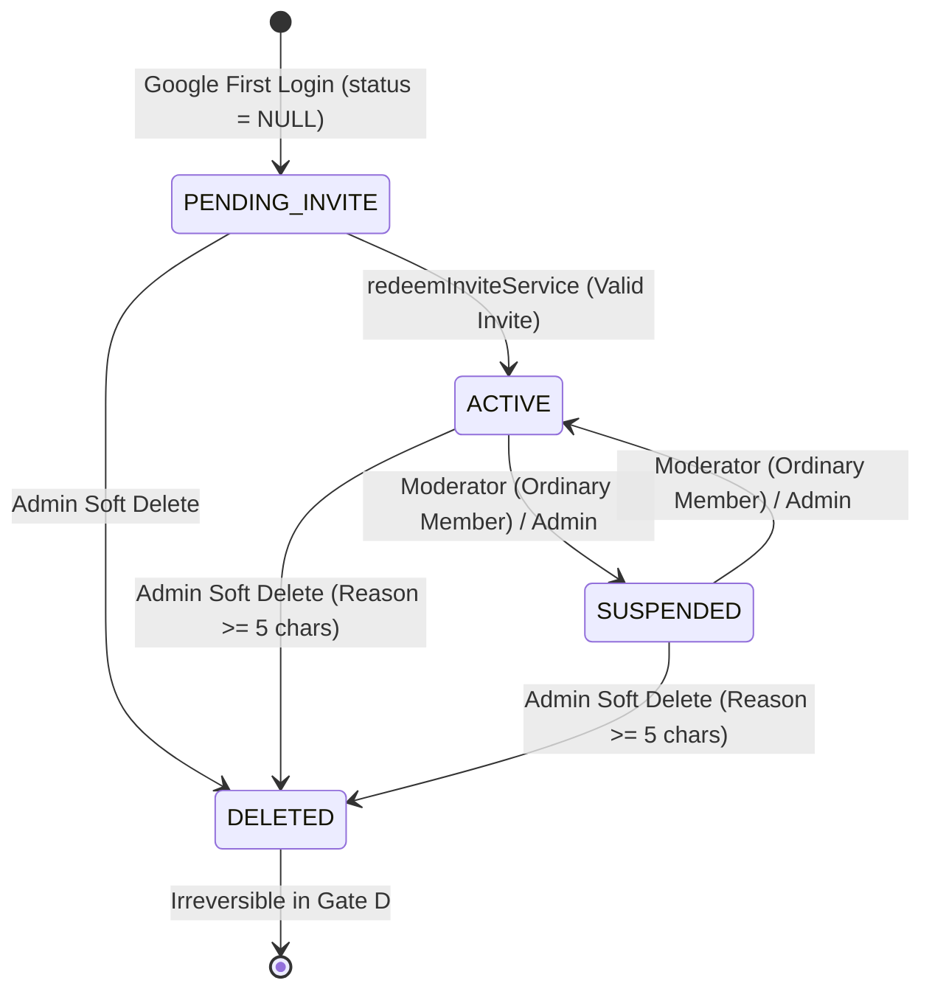

# Implementation Plan — Gate D: Authentication, Invitations, Membership & Roles (Blueprint 2.2.1 — Final)

This document defines the final authoritative implementation plan for **Gate D (Authentication, Invitations, Membership & Roles)** under [Art_Community_App_Implementation_Blueprint_2.2.1.md](file:///home/garion/Projects/Mengart/Art_Community_App_Implementation_Blueprint_2.2.1.md) and [Mengart_Blueprint_2.2.1_Remediation_Plan.md](file:///home/garion/Projects/Mengart/Mengart_Blueprint_2.2.1_Remediation_Plan.md).

> [!IMPORTANT]
> **Plan Mode Only**: No production code, schema, migrations, UI, or tests will be modified until this final plan receives independent review and approval.  
> Authoritative baseline commit: `94ab50040bf226039fc5c1a1f464faf9d95236a5`.

---

## 1. Executive Summary & Core Architectural Invariants

Gate D establishes an invitation-gated, Google-only authentication, membership, and RBAC system for a private, trusted digital art community of fewer than 100 members.

### Core Architectural Invariants:
1. **Google OAuth as the Sole Authentication Method:**
   - Active email/password registration, password hashes, password reset emails, email verification links, and SMTP infrastructure are completely removed.
   - `bcryptjs` runtime dependencies and package dependencies are eliminated.
2. **`PENDING_INVITE` Separation from Persistent Membership:**
   - Persistent membership states are strictly 3 values: `ACTIVE`, `SUSPENDED`, `DELETED`.
   - `PENDING_INVITE` is an onboarding/access gate, **NOT a fourth membership status enum value**.
   - In PostgreSQL, `users.membership_status` is a nullable enum (`'active' | 'suspended' | 'deleted'`) with **NO default**.
   - An authenticated Google onboarding account has `membership_status IS NULL`.
   - The application and session derive `PENDING_INVITE` whenever an authenticated user has `membership_status === null`.
3. **Invitation Administration is Admin-Only:**
   - Moderators are community operators only and must **NOT** create, revoke, or administer invite credentials.
   - Invitation administration (`/admin/invites`, `createInviteAction`, `revokeInviteAction`) requires `role === 'admin' && membership_status === 'active'`.
4. **Cryptographic High-Entropy Invites Only:**
   - Low-entropy vanity/custom bearer codes are removed.
   - Every invite credential consists of a cryptographically random high-entropy token ($\ge 16$ bytes base58, $>100$ bits entropy).
   - Staff may attach an optional human-readable `label` (e.g. "Bali Art Summit 2026").
   - Raw tokens are never logged or stored in plaintext; database stores SHA-256 `token_hash` and a short non-secret display prefix (e.g., `inv_8f9a...`).
5. **Deterministic Transactional Redemption & Concurrency Locking:**
   - `redeemInviteService` executes within a single database transaction with deterministic two-phase row locking:
     1. Lock target `users` row `FOR UPDATE` (by `user.id`).
     2. Lock target `membership_invites` row `FOR UPDATE` (by `token_hash`).
   - Re-reads and enforces:
     - `membership_status IS NULL` $\rightarrow$ proceeds with redemption.
     - `ACTIVE` $\rightarrow$ idempotent no-op, no usage consumed, returns existing profile.
     - `SUSPENDED` $\rightarrow$ rejected, never reactivated.
     - `DELETED` $\rightarrow$ rejected.
   - Revalidates expiry, revocation, and `max_uses` inside the lock before atomically incrementing `uses_count`, setting `membership_status = 'active'`, creating `profiles`, and writing `audit_logs`.
6. **Authoritative Membership State Transition Matrix:**
   - Generic Admin/Moderator status updates (`updateUserStatusAction`) cannot bypass invitation admission:
     - `NULL -> ACTIVE`: Permitted **ONLY** through `redeemInviteService` upon valid invite redemption.
     - `ACTIVE -> SUSPENDED`: Moderator for ordinary `member`, or Admin.
     - `SUSPENDED -> ACTIVE`: Moderator for ordinary `member`, or Admin.
     - `ACTIVE / SUSPENDED -> DELETED`: Admin-only with mandatory $\ge 5$ char reason.
     - `DELETED -> any other state`: Strictly irreversible in Gate D (generic status action rejects deleted users).
7. **Serialized Last-Active-Admin Protection:**
   - All mutations altering the `ACTIVE` Admin set (demotion, suspension, soft-deletion) acquire a dedicated transaction advisory lock (`pg_advisory_xact_lock`) before checking/applying the invariant.
   - Prevents concurrent race conditions from dropping the active Admin count to zero.
8. **Case-Insensitive Email Normalization & Collision Defense:**
   - Migration `0011` validates that no case-insensitive duplicate emails exist in legacy data, normalizes legacy emails to `lower(trim(email))`, and enforces a unique index `uniq_users_lower_email` on `lower(email)`.
9. **Safe Google Identity Resolution:**
   - Requires Google `email_verified === true`.
   - Strict resolution order:
     1. Lookup by `google_id = profile.sub`.
     2. Lookup by exact normalized email (`email.trim().toLowerCase()`).
     3. If matching legacy account has `google_id IS NULL`: bind verified `google_id`.
     4. Existing account with a different non-null Google ID $\rightarrow$ rejected.
     5. Google ID and email resolving to different users $\rightarrow$ rejected.
     6. `DELETED` account $\rightarrow$ rejected.
   - Existing active/suspended legacy users reuse their account without consuming an invitation.
   - `allowDangerousEmailAccountLinking` and broad automatic provider merging are removed.
10. **Secure OAuth Continuation Cookie Lifecycle:**
    - Cookie `mengart_pending_invite`: `HttpOnly`, `SameSite=Lax`, `Secure` (in production), `Path=/`, host-only, TTL `15 minutes`.
    - Cleared after successful auto-redemption, invalid invite attempt, ACTIVE pass-through, SUSPENDED rejection, or DELETED rejection.
11. **App-Wide Write Surface Audit & Active Membership Guard:**
    - Every ordinary member/staff mutation requires `ACTIVE` membership, except explicitly authorized authentication/onboarding operations such as `PENDING_INVITE` invitation redemption (`redeemInviteService`).
    - Master clean media delivery (`/api/media/master/[key]`) rejects Anonymous, Pending (`NULL`), and Suspended members; requires `ACTIVE` membership or asset ownership.

---

## 2. Gap Analysis vs. Authoritative Blueprint 2.2.1

| Component / Feature | Current Baseline | Authoritative Blueprint 2.2.1 Target | Required Gate D Action |
| :--- | :--- | :--- | :--- |
| **Auth Provider** | Dual: Google OAuth + Credentials Provider (`bcrypt` username/email). | **Google OAuth ONLY**. | Remove `Credentials` provider, remove password form UI, eliminate runtime `bcrypt` auth paths and dependencies. |
| **Email / SMTP Flows** | `sendVerificationEmail`, `sendPasswordResetEmail`, `emailVerificationTokens`, `passwordResetTokens`. | **No SMTP, verification emails, or password reset tokens.** | Drop token tables explicitly, delete email dispatch functions, delete deprecated routes (`/verify-email`, `/forgot-password`, `/reset-password/*`). |
| **Membership Status Enum** | `enum('active', 'suspended', 'revoked')`. | Exactly **`ACTIVE`**, **`SUSPENDED`**, **`DELETED`**. | Migration `0011` renames old enum, creates `enum('active', 'suspended', 'deleted')`, converts `revoked` $\rightarrow$ `suspended`, `deleted_at` $\rightarrow$ `deleted` inside `USING` clause. |
| **`PENDING_INVITE` Model** | Not formally separated; new Google logins rejected if not pre-seeded. | **Onboarding gate derived from `membership_status IS NULL`.** | Column `users.membership_status` is nullable with no default; session derives `PENDING_INVITE` when status is null. |
| **Membership Transition Governance** | Admin can set any status for any user. | **Strict Transition Matrix.** | Prevent `NULL -> ACTIVE` from admin UI; require `redeemInviteService`; make `DELETED` irreversible. |
| **Invite Administration** | Moderator and Admin can create/revoke invites. | **Admin-ONLY.** | Restrict `createInviteAction`, `revokeInviteAction`, and `/admin/invites` to `requireAdmin`. |
| **Invite Token Entropy** | Allows custom/vanity strings (e.g. `atelier-vip`). | **Cryptographic high-entropy tokens ONLY.** | Enforce 16+ byte clean base58 token generation; remove custom vanity code path; allow human-readable `label`. |
| **Redemption Locking** | Single-table lock on `membership_invites`. | **Deterministic 2-phase lock**: `users` row `FOR UPDATE` $\rightarrow$ `membership_invites` row `FOR UPDATE`. | Implement atomic transaction order, active member idempotency, suspended/deleted rejections, and serialize with revocation. |
| **Last-Active-Admin Invariant** | Unprotected count check. | **Serialized Invariant via Advisory Lock.** | `pg_advisory_xact_lock` prevents concurrent demote/suspend/delete from zeroing active Admins. |
| **Email Identity Normalization** | Case-sensitive uniqueness. | **Case-insensitive normalization + uniqueness.** | Migration `0011` fails on case-insensitive duplicates, normalizes emails to lowercase, and creates `uniq_users_lower_email`. |
| **Google Resolution** | `allowDangerousEmailAccountLinking: true`. | **Safe deterministic resolution order** with `email_verified` check and collision rejection. | Implement strict 6-step resolution order in NextAuth `signIn` callback. |
| **Legacy Code Reconciliation** | Live references to `revoked`, `bcryptjs`, and old tests exist. | **Complete reconciliation.** | Update `policy.ts`, `testPhase2VotingAndTiebreak.ts`, `package.json`; delete obsolete tests; add static regression assertions. |

---

## 3. Database Schema & Migration Strategy (0011)

### 3.1 Migration Immutability & Naming
- Committed migrations `0000` through `0010` remain strictly **immutable**.
- All Gate D schema modifications are contained in:
  `drizzle/0011_gate_d_auth_roles_membership.sql`

### 3.2 Drizzle Schema Definition Updates

#### 1. Update `src/db/schema/users.ts`:
```typescript
import { pgTable, text, timestamp, uuid, bigint, pgEnum, index, uniqueIndex } from "drizzle-orm/pg-core";
import { sql } from "drizzle-orm";

export const userRoleEnum = pgEnum("user_role", ["member", "moderator", "admin"]);
export const membershipStatusEnum = pgEnum("membership_status", [
  "active",
  "suspended",
  "deleted",
]);

export const users = pgTable(
  "users",
  {
    id: uuid("id").primaryKey().defaultRandom(),
    email: text("email").notNull().unique(),
    username: text("username").unique(),
    googleId: text("google_id").unique(),
    emailVerified: timestamp("email_verified", { withTimezone: true }),
    role: userRoleEnum("role").default("member").notNull(),
    // Nullable with NO default: NULL represents an authenticated Google user in PENDING_INVITE onboarding state
    membershipStatus: membershipStatusEnum("membership_status"),
    storageQuotaBytes: bigint("storage_quota_bytes", { mode: "number" })
      .default(1073741824) // 1 GB default quota
      .notNull(),
    createdAt: timestamp("created_at", { withTimezone: true }).defaultNow().notNull(),
    updatedAt: timestamp("updated_at", { withTimezone: true }).defaultNow().notNull(),
    deletedAt: timestamp("deleted_at", { withTimezone: true }),
    deletedBy: uuid("deleted_by"),
    deletionReason: text("deletion_reason"),
  },
  (table) => [
    uniqueIndex("uniq_users_lower_email").on(sql`lower(${table.email})`),
    index("idx_users_username").on(table.username),
    index("idx_users_google_id").on(table.googleId),
    index("idx_users_membership_status").on(table.membershipStatus),
  ]
);
```

#### 2. Update `src/db/schema/invites.ts`:
- Ensure `maxUses` is nullable integer (`null` = unlimited uses).
- Ensure foreign keys `createdBy` and `revokedBy` reference `users.id` with `onDelete: "set null"`.

#### 3. Deprecate / Drop `src/db/schema/authTokens.ts`:
- Drop `emailVerificationTokens` and `passwordResetTokens` from schema and delete file.

### 3.3 Forward Migration SQL Script (`0011_gate_d_auth_roles_membership.sql`)
```sql
-- ============================================================================
-- GATE D FORWARD MIGRATION: AUTHENTICATION, INVITATIONS, MEMBERSHIP & ROLES
-- ============================================================================

-- 1. Email Normalization & Collision Detection
DO $$
BEGIN
  IF EXISTS (
    SELECT 1 FROM (
      SELECT lower(trim("email")) AS norm_email, count(*) AS cnt
      FROM "users"
      GROUP BY lower(trim("email"))
      HAVING count(*) > 1
    ) duplicates
  ) THEN
    RAISE EXCEPTION 'Legacy email reconciliation failed: duplicate case-insensitive email addresses detected in users table';
  END IF;
END $$;

UPDATE "users" SET "email" = lower(trim("email"));

DROP INDEX IF EXISTS "idx_users_email";
CREATE UNIQUE INDEX IF NOT EXISTS "uniq_users_lower_email" ON "users" (lower("email"));

-- 2. Rename Old Enum & Create New 3-Value Membership Enum
ALTER TYPE "membership_status" RENAME TO "membership_status_old";
CREATE TYPE "membership_status" AS ENUM ('active', 'suspended', 'deleted');

-- 3. Drop Default and Drop NOT NULL (NULL represents PENDING_INVITE)
ALTER TABLE "users" ALTER COLUMN "membership_status" DROP DEFAULT;
ALTER TABLE "users" ALTER COLUMN "membership_status" DROP NOT NULL;

-- 4. Convert Column Type with In-Flight Status Reconciliation
ALTER TABLE "users" 
  ALTER COLUMN "membership_status" 
  TYPE "membership_status" 
  USING (
    CASE 
      WHEN "deleted_at" IS NOT NULL THEN 'deleted'::"membership_status"
      WHEN "membership_status"::text = 'revoked' THEN 'suspended'::"membership_status"
      ELSE "membership_status"::text::"membership_status"
    END
  );

-- 5. Drop Old Enum
DROP TYPE "membership_status_old";

-- 6. Explicitly Drop Deprecated Token Tables (fail-closed without CASCADE)
DROP TABLE IF EXISTS "email_verification_tokens";
DROP TABLE IF EXISTS "password_reset_tokens";

-- 7. Drop Deprecated password_hash Column Cleanly
ALTER TABLE "users" DROP COLUMN IF EXISTS "password_hash";

-- 8. Index on Membership Status
CREATE INDEX IF NOT EXISTS "idx_users_membership_status" ON "users" ("membership_status");
```

---

## 4. Authoritative Membership State Transition Matrix

The table below governs all valid membership state transitions across the application.



| Source State | Target State | Permitted Actor / Service | Rules & Guard Invariants |
| :--- | :--- | :--- | :--- |
| `NULL` (Pending) | `ACTIVE` | `redeemInviteService` ONLY | Validates invite hash, unexpired, unrevoked, `uses < maxUses`. Increments `uses_count`. Creates profile and audit log. **Generic `updateUserStatusAction` is strictly rejected.** |
| `NULL` (Pending) | `DELETED` | Admin only | Allows banning an onboarding bad actor before redemption. |
| `ACTIVE` | `SUSPENDED` | Moderator (for `member`), Admin (for any user) | Moderator cannot target Moderator/Admin. Subject to **Last-Active-Admin serialization lock**. |
| `SUSPENDED` | `ACTIVE` | Moderator (for `member`), Admin (for any user) | Moderator cannot target Moderator/Admin. **Invites cannot be used to reactivate a suspended account.** |
| `ACTIVE` | `DELETED` | Admin only | Mandatory reason ($\ge 5$ chars). Profile set to hidden. Blocked at sign-in. Subject to **Last-Active-Admin serialization lock**. |
| `SUSPENDED` | `DELETED` | Admin only | Mandatory reason ($\ge 5$ chars). Profile set to hidden. Blocked at sign-in. |
| `DELETED` | Any State | **NONE** | **Irreversible in Gate D.** `updateUserStatusAction` strictly rejects targets where `membership_status === 'deleted'`. |

---

## 5. Serialized Last-Active-Admin Invariant

To eliminate concurrent race conditions when demoting, suspending, or deleting Admins:

```typescript
const ADMIN_MEMBERSHIP_ADVISORY_LOCK_KEY = 4281729;

export async function assertActiveAdminInvariant(tx: DatabaseTransaction, targetUserId: string, willRemoveAdmin: boolean) {
  // 1. Acquire transaction-level advisory lock dedicated to Admin membership mutations
  await tx.execute(sql`SELECT pg_advisory_xact_lock(${ADMIN_MEMBERSHIP_ADVISORY_LOCK_KEY})`);

  if (!willRemoveAdmin) return;

  // 2. Count current ACTIVE Admins with row locking
  const [adminStats] = await tx
    .select({ count: sql<number>`count(*)::int` })
    .from(users)
    .where(and(eq(users.role, "admin"), eq(users.membershipStatus, "active")));

  // 3. Check if target user is currently an ACTIVE Admin
  const [target] = await tx
    .select({ role: users.role, membershipStatus: users.membershipStatus })
    .from(users)
    .where(eq(users.id, targetUserId));

  const isTargetActiveAdmin = target?.role === "admin" && target?.membershipStatus === "active";

  if (isTargetActiveAdmin && adminStats.count <= 1) {
    throw new Error("Operasi ditolak: Komunitas harus memiliki setidaknya satu Administrator aktif.");
  }
}
```

---

## 6. Authoritative Two-Phase Lock Redemption & Concurrency

### 6.1 Deterministic Two-Phase Locking (`redeemInviteService`)

```typescript
export async function redeemInviteService(
  dbOrTx: DatabaseOrTransaction,
  params: {
    userId: string;
    rawToken: string;
    displayName?: string;
    avatarUrl?: string;
    ipAddress?: string;
    userAgent?: string;
  }
) {
  const tokenHash = hashInviteToken(params.rawToken);
  const now = new Date();

  return await dbOrTx.transaction(async (tx) => {
    // 1. Lock target user row FOR UPDATE
    const [user] = await tx
      .select()
      .from(users)
      .where(eq(users.id, params.userId))
      .for("update");

    if (!user) {
      throw new Error("Pengguna tidak ditemukan.");
    }

    // Enforce membership status invariants
    if (user.membershipStatus === "active") {
      // Idempotent pass-through: already active, do not consume invite
      const [profile] = await tx.select().from(profiles).where(eq(profiles.userId, user.id)).limit(1);
      return { user, profile, isAlreadyActive: true };
    }
    if (user.membershipStatus === "suspended") {
      throw new Error("Akun Anda sedang ditangguhkan. Undangan tidak dapat digunakan untuk mengaktifkan kembali akun.");
    }
    if (user.membershipStatus === "deleted" || user.deletedAt) {
      throw new Error("Akun telah dihapus.");
    }

    // 2. Lock target invite row FOR UPDATE
    const [invite] = await tx
      .select()
      .from(membershipInvites)
      .where(eq(membershipInvites.tokenHash, tokenHash))
      .for("update");

    if (!invite) {
      throw new Error("Undangan tidak valid atau tidak ditemukan.");
    }
    if (invite.revokedAt) {
      throw new Error("Undangan telah dicabut oleh administrator.");
    }
    if (invite.expiresAt && invite.expiresAt <= now) {
      throw new Error("Undangan telah kedaluwarsa.");
    }
    if (invite.maxUses !== null && invite.usesCount >= invite.maxUses) {
      throw new Error("Batas penggunaan undangan ini telah habis.");
    }

    // 3. Atomically increment usage count
    await tx
      .update(membershipInvites)
      .set({
        usesCount: sql`${membershipInvites.usesCount} + 1`,
        updatedAt: now,
      })
      .where(eq(membershipInvites.id, invite.id));

    // 4. Update user to ACTIVE
    const [updatedUser] = await tx
      .update(users)
      .set({
        membershipStatus: "active",
        emailVerified: user.emailVerified || now,
        updatedAt: now,
      })
      .where(eq(users.id, user.id))
      .returning();

    // 5. Create or reconcile artist profile
    const rawName = params.displayName || user.username || user.email.split("@")[0] || "Artist";
    const baseSlug = rawName.toLowerCase().replace(/[^a-z0-9]+/g, "-").replace(/(^-|-$)/g, "") || `artist-${user.id.slice(0, 8)}`;
    const [existingSlug] = await tx.select({ id: profiles.id }).from(profiles).where(eq(profiles.slug, baseSlug)).limit(1);
    const finalSlug = existingSlug ? `${baseSlug}-${user.id.slice(0, 6)}` : baseSlug;

    let [profile] = await tx.select().from(profiles).where(eq(profiles.userId, user.id)).limit(1);
    if (!profile) {
      [profile] = await tx
        .insert(profiles)
        .values({
          userId: user.id,
          slug: finalSlug,
          displayName: rawName.trim(),
          avatarUrl: params.avatarUrl || null,
          profileStatus: "incomplete",
        })
        .returning();
    }

    // 6. Record redemption history
    await tx.insert(inviteRedemptions).values({
      inviteId: invite.id,
      userId: user.id,
      ipAddress: params.ipAddress || null,
      userAgent: params.userAgent || null,
      redeemedAt: now,
    });

    // 7. Audit log
    await tx.insert(auditLogs).values({
      actorId: user.id,
      actorIp: params.ipAddress || "127.0.0.1",
      action: "invite_redeemed",
      targetType: "invite",
      targetId: invite.id,
      reason: `Membership activated via invite ${invite.tokenPrefix}`,
      metadata: {
        inviteId: invite.id,
        tokenPrefix: invite.tokenPrefix,
        userId: user.id,
        email: user.email,
      },
    });

    return { user: updatedUser, profile, isAlreadyActive: false };
  });
}
```

### 6.2 Revoke-vs-Redeem Concurrency Semantics
- Both `redeemInviteService` and `revokeInviteAction` serialize on the `membership_invites` row using `FOR UPDATE`.
- **If Revocation locks/commits first:**
  - Redemption wakes up, reads `revokedAt IS NOT NULL`, fails with `"Undangan telah dicabut oleh administrator."`, and consumes zero usage.
- **If Redemption locks/commits first:**
  - One valid redemption completes and increments `usesCount`.
  - Revocation commits afterward (`revokedAt = NOW()`).
  - All subsequent redemptions fail closed upon reading `revokedAt IS NOT NULL`.

---

## 7. App-Wide Write Surface & Master Media Audit

> **Rule:** Every ordinary member/staff mutation requires `ACTIVE` membership, except explicitly authorized authentication/onboarding operations such as `PENDING_INVITE` invitation redemption (`redeemInviteService`).

| Action / Surface | Target Feature | Guard Protocol & Invariant |
| :--- | :--- | :--- |
| `submitChallengeEntryAction` | Challenge Submission | `requireActiveMember()` + DB refresh |
| `replaceSubmissionAction` | Submission Revision | `requireActiveMember()` + DB refresh |
| `castStarBallotAction` | Voting | `requireActiveMember()` + DB refresh |
| `resetBallotAction` | Ballot Reset | `requireActiveMember()` + DB refresh |
| `createArtworkAction` | Portfolio Upload | `requireActiveMember()` + DB refresh |
| `updateArtworkAction` | Artwork Metadata | `requireActiveMember()` + DB refresh |
| `deleteArtworkAction` | Artwork Removal | `requireActiveMember()` + DB refresh |
| `postCritiqueCommentAction` | Critique Feedback | `requireActiveMember()` + DB refresh |
| `pinCritiqueCommentAction` | Pin Comment | `requireActiveMember()` + DB refresh |
| `createCommissionServiceAction`| Artist Services | `requireActiveMember()` + DB refresh |
| `updateCommissionServiceAction`| Commission Scope | `requireActiveMember()` + DB refresh |
| `createInviteAction` | Invite Creation | `requireAdmin()` + DB refresh |
| `revokeInviteAction` | Invite Revocation | `requireAdmin()` + DB refresh |
| `updateUserRoleAction` | RBAC Management | `requireAdmin()` + Advisory Lock + Last-Admin Guard |
| `updateUserStatusAction` | Member Moderation | `requireModerator()` / `requireAdmin()` + Transition Matrix + Advisory Lock |
| `GET /api/media/master/[key]` | Master Clean Asset | Rejects Anonymous, Pending (`NULL`), Suspended; requires `ACTIVE` member or asset owner |

---

## 8. Complete Legacy Auth Removal & Codebase Reconciliation

### 8.1 Files to Remove
1. `src/app/verify-email/page.tsx` $\rightarrow$ Delete file.
2. `src/app/forgot-password/page.tsx` $\rightarrow$ Delete file.
3. `src/app/reset-password/[token]/page.tsx` $\rightarrow$ Delete route directory.
4. `src/db/schema/authTokens.ts` $\rightarrow$ Delete file; remove schema exports.
5. `src/lib/__tests__/testAuthAndMerging.ts` $\rightarrow$ Delete file (superseded by Gate D suite).
6. `src/lib/__tests__/testInvites.ts` $\rightarrow$ Delete file (superseded by Gate D suite).

### 8.2 Legacy Code Reconciliation
1. `src/lib/policy.ts`: Update membership type from `'active' | 'suspended' | 'revoked'` to `'active' | 'suspended' | 'deleted' | null`.
2. `src/lib/__tests__/testPhase2VotingAndTiebreak.ts`: Update test fixtures using `revoked` to `suspended`.
3. `package.json` & `package-lock.json`: Remove `bcryptjs` and `@types/bcryptjs`.
4. `src/lib/email.ts`: Remove `sendVerificationEmail` and `sendPasswordResetEmail`.
5. `src/db/seedTestAccounts.ts`: Seed test accounts with `googleId`, `emailVerified = NOW()`, `membershipStatus = 'active'`.

### 8.3 Static Regression Assertions
A dedicated static test in `testPhase4AuthAndInvites.ts` will verify:
- Zero occurrences of `CredentialsProvider` or `signIn("credentials")` in production code.
- Zero occurrences of `password_hash` or `passwordHash` in active schemas/queries.
- Zero occurrences of `bcrypt` imports across `src/app`, `src/lib`, `src/db`.
- Zero occurrences of `'revoked'` as a membership status.
- Invitation revocation (`revoked_at`, `revokedBy`) remains fully supported.

---

## 9. Comprehensive Security & Invariant Test Matrix

The test suite `src/lib/__tests__/testPhase4AuthAndInvites.ts` will verify all 22 Gate D scenarios:

1. **Test 1 — `PENDING_INVITE` Separation:** Authenticated new Google user receives `membership_status = NULL`. Application derives `PENDING_INVITE`.
2. **Test 2 — Verified Legacy Google Account Reuse:** Pre-existing user with matching email logs in; binds `google_id`; preserves `ACTIVE`/`SUSPENDED` status without consuming an invite.
3. **Test 3 — Case-Insensitive Email Matching:** Mixed-case legacy email (e.g. `Artist.One@Example.COM`) safely matches `artist.one@example.com`.
4. **Test 4 — Unverified Google Email Rejection:** OAuth payload with `email_verified: false` is rejected during sign-in.
5. **Test 5 — Google ID & Email Collision Rejection:** Mismatched `google_id` or cross-account email collision fails closed with descriptive error.
6. **Test 6 — Suspended Member Invite Redemption Rejection:** Suspended member attempting to redeem an invite is rejected; account is never reactivated via invite.
7. **Test 7 — Deleted User Rejection:** Soft-deleted user is blocked at sign-in; invite redemption by deleted user is rejected.
8. **Test 8 — Transition Matrix: Direct NULL $\rightarrow$ ACTIVE via Admin Action Blocked:** Attempting to activate a pending user via `updateUserStatusAction` throws transition violation error.
9. **Test 9 — Same Pending User Concurrent Redemption:** Pending user concurrently redeeming two invites consumes exactly 1 invite; second redemption is an active no-op.
10. **Test 10 — Last Invite Slot Concurrency:** Invite with `max_uses = 1` concurrently redeemed by two users succeeds for exactly 1 user and fails for the second.
11. **Test 11 — Revoke vs. Redeem Race:** Serialized transaction ensures redemption on a revoked invite fails closed; redemption preceding revocation completes cleanly.
12. **Test 12 — Moderator Invite Administration Denial:** Moderator attempting `createInviteAction` or `revokeInviteAction` is rejected (`requireAdmin`).
13. **Test 13 — Moderator Cannot Suspend/Demote Admin:** Moderator attempting to suspend a Moderator or Admin is rejected.
14. **Test 14 — Last ACTIVE Admin Protection (Advisory Lock Concurrency):** Concurrent demote/suspend/delete attempts against 2 active Admins never drops active Admin count to 0. Direct deletion of sole active Admin is rejected.
15. **Test 15 — Pending User Clean Media Access Denial:** User with `membership_status IS NULL` requesting `/api/media/master/[key]` receives 403 Forbidden.
16. **Test 16 — Suspended Staff Action Denial:** Suspended Moderator or Admin immediately loses challenge management and moderation privileges.
17. **Test 17 — Continuation Cookie Lifecycle:** Cookie set on `/invite/[token]`, automatically consumed on callback, cleared on invalid, active, suspended, or deleted outcomes.
18. **Test 18 — Legacy Auth Rejection:** Confirm credentials login, password reset, and verification endpoints return 404 or rejection.
19. **Test 19 — Multi-Use Limit (`max_uses = 3`):** Allows exactly 3 redemptions and exhausts.
20. **Test 20 — Unlimited Invite (`max_uses = null`):** Allows 10+ redemptions without exhausting.
21. **Test 21 — Active Member Replay:** Active member visiting invite link is an idempotent pass-through; `uses_count` is not incremented.
22. **Test 22 — Static Regression Assertions:** Confirms zero production credentials, password hashes, bcrypt paths, or membership `revoked`.

---

## 10. Files Expected to Change

### Database & Schema
- `src/db/schema/users.ts` (3-value enum, nullable status, lower-email index, passwordHash dropped)
- `src/db/schema/invites.ts` (nullable maxUses, FK definitions)
- `src/db/schema/authTokens.ts` (**DELETED**)
- `src/db/schema/index.ts` (exports cleaned)
- `drizzle/0011_gate_d_auth_roles_membership.sql` (**NEW**)
- `src/db/seedTestAccounts.ts` (Google identity seeding)

### Auth & RBAC Core
- `src/auth.ts` (Google-only, safe identity resolution, session status)
- `src/lib/rbac.ts` (centralized `requireActiveMember`, `requireModerator`, `requireAdmin`, advisory lock last-admin guard)
- `src/lib/invites.ts` (two-phase locking `redeemInviteService`, high-entropy tokens, admin checks)
- `src/lib/email.ts` (remove SMTP verification/reset helpers)
- `src/lib/policy.ts` (update membership status types)

### Actions & Endpoints
- `src/app/actions/auth.ts` (remove credentials actions, add `redeemOnboardingInviteAction`)
- `src/app/actions/invites.ts` (restrict to `requireAdmin`)
- `src/app/actions/admin.ts` (transition matrix, advisory lock last-admin guard, moderator bounds)
- `src/app/api/auth/redeem-callback/route.ts` (continuation cookie handling)
- `src/app/api/media/master/[key]/route.ts` (pending & suspended user access denial)
- `src/app/verify-email/page.tsx` (**DELETED**)
- `src/app/forgot-password/page.tsx` (**DELETED**)
- `src/app/reset-password/[token]/page.tsx` (**DELETED**)

### UI & Pages
- `src/app/login/page.tsx` & `src/components/auth/LoginForm.tsx` (Google-only UI)
- `src/app/onboarding/page.tsx` (**NEW**: manual invite code entry)
- `src/app/invite/[token]/page.tsx` & `src/components/auth/InviteRedeemForm.tsx` (OAuth continuation UI)
- `src/app/admin/invites/page.tsx` (admin-only view)
- `src/app/admin/users/page.tsx` & `src/components/admin/UserManagementTable.tsx` (transition matrix UI)

### Dependencies & Tests
- `package.json` & `package-lock.json` (remove `bcryptjs`, `@types/bcryptjs`)
- `scripts/verifyMigrations.ts` (Scenario 8: Migration 0010 $\rightarrow$ 0011 upgrade)
- `src/lib/__tests__/testPhase4AuthAndInvites.ts` (**NEW**: 22-scenario suite)
- `src/lib/__tests__/testAuthAndMerging.ts` (**DELETED**)
- `src/lib/__tests__/testInvites.ts` (**DELETED**)
- `src/lib/__tests__/testPhase2VotingAndTiebreak.ts` (reconcile fixtures)
- `src/lib/__tests__/testGate1SecurityAndIntegrity.ts` (update for Google auth)
- `src/lib/__tests__/testLoginFlow.ts` (update for Google OAuth & PENDING_INVITE)

---

## 11. Verification Commands & QA Format-Patch Export

Following implementation, verification will execute all 7 required commands:

```bash
npm run test:migrate
npx tsx src/lib/__tests__/testPhase4AuthAndInvites.ts
npx tsx src/lib/__tests__/testPhase2VotingAndTiebreak.ts
npx tsx src/lib/__tests__/testPhase3SimplifiedJury.ts
npm run test:all
npm run lint
npm run build
```

After all checks pass, the Gate D QA format-patch artifact will be generated exactly via:

```bash
git format-patch \
  --stdout \
  --binary \
  --full-index \
  94ab50040bf226039fc5c1a1f464faf9d95236a5..GATE_D_SHA \
  > gated.patch
```

---

## 12. Explicit Deferred Scope (Gates E–H)

| Gate | Scope | Explicitly Deferred From Gate D |
| :--- | :--- | :--- |
| **Gate E** | Submission & Portfolio Simplification | Single active submission per member, direct media replacement before deadline, removal of version tables, auto-portfolio addition. |
| **Gate F** | Media Pipeline & Rate Limiting | FFmpeg video watermarking, H.264/AAC transcoding, strict container/codec validation, sliding-window rate limiters. |
| **Gate G** | Community UX, Story Cards & A11y | 9:16 Story Card Canvas generator, accessible Radix dialogs/overlays, Playwright + axe automated accessibility audit across all 6 personas. |
| **Gate H** | Production Operations & Disaster Recovery | Off-server encrypted S3/GCS backups, fail-closed backup secrets, manifest-driven DB/media restore verification. |
